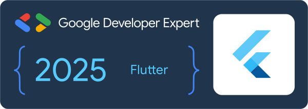

# Namaste, Damodar here from Nepal! 👋

I'm an **author**, **mentor**, **trainer**, and **tech consultant**. I'm currently working as a Software Engineer at [Appwrite](https://appwrite.io).

 

> 
> 🎉 Exciting News! 🎉
> 
> Level up your Flutter skills in just 30 days with 🚀 [30DaysMasterFlutter](https://appwriters.dev/30days/flutter) 🚀
>

## 👷 Check out what I'm currently working on

  - [Mero Nepali, learning app for kids](https://play.google.com/store/apps/details?id=dev.appwriters.mero_nepali)
  - [Flutter Appwrite course](https://appwriters.dev/courses/flutter-appwrite)
  - [Master Flutter](https://masterflutter.appwriters.dev)
  - [Appwriters.dev](https://appwriters.dev)
  - [Appwrite](https://github.com/appwrite/appwrite)
  - [Appwrite Auth Kit](https://github.com/lohanidamodar/appwrite_auth_kit)
  - [Clean Nepali Calendar](https://github.com/lohanidamodar/clean_nepali_calendar)
  - [Utopia Dart Framework](https://github.com/utopia-dart)
  - [Taking Flutter to Web, book](https://www.amazon.com/Taking-Flutter-Web-cross-platform-platforms/dp/1801817715)

## Tech Stack

   

## Connect with me:

## 📺 Latest YouTube Videos
<!-- YOUTUBE:START -->
- [Flutter - Interactive map from SVG](https://www.youtube.com/watch?v=RMN1e9NGNIE)
- [[ 10 ] Authenticated routes - Cross platform applications with Flutter and Appwrite 2024](https://www.youtube.com/watch?v=hiDDqbOVoHg)
- [[ 09 ] Authentication state manager - Cross platform applications with Flutter and Appwrite 2024](https://www.youtube.com/watch?v=NhGgCVC5XjY)
- [[ 08 ] Authenticate user - login - Cross platform applications with Flutter and Appwrite 2024](https://www.youtube.com/watch?v=SjvL-hkn-UY)
- [[ 07 ] Creating account for your user - Cross platform applications with Flutter and Appwrite 2024](https://www.youtube.com/watch?v=fuA9scGDaEs)
- [[ 06 ] Routing - Cross platform applications with Flutter and Appwrite 2024](https://www.youtube.com/watch?v=69HUy0mGIaU)
- [[ 05 ] Setup state management - Cross platform applications with Flutter and Appwrite 2024](https://www.youtube.com/watch?v=8k42p7HK8v0)
- [[ 04 ] Dependency injection - Cross platform applications with Flutter and Appwrite 2024](https://www.youtube.com/watch?v=oc73TnuEitg)
- [[ 03 ] Integrating Flutter and Appwrite - Cross platform applications with Flutter and Appwrite 2024](https://www.youtube.com/watch?v=3-ejU2yU-rQ)
- [[ 02 ] Getting started with Flutter - Cross platform applications with Flutter and Appwrite 2024](https://www.youtube.com/watch?v=EmCLluiaXyo)
<!-- YOUTUBE:END -->

## 📕 Latest Blog Posts
<!-- BLOG-POST-LIST:START -->
- [Appwrite is now available as a one-click app on the Akamai cloud &lpar;Linode&rpar; marketplace](https://dev.to/appwrite/appwrite-is-now-available-as-a-one-click-app-on-the-akamai-cloud-linode-marketplace-5ajp)
- [Embark on a Project-Based Learning Adventure with Our #30DaysMasterFlutter Challenge and Become a…](https://lohanidamodar.medium.com/embark-on-a-project-based-learning-adventure-with-our-30daysmasterflutter-challenge-and-become-a-fd22f76d2602?source=rss-21afa4abace7------2)
- [Join our #30DaysMasterFlutter Challenge and Learn Flutter &amp; Dart in One Month!](https://dev.to/lohanidamodar/join-our-30daysmasterflutter-challenge-and-master-flutter-dart-in-one-month-16be)
- [Protect Your Applications from Bad Passwords - Introducing Password History](https://dev.to/appwrite/protect-your-applications-from-bad-passwords-introducing-password-history-19n5)
- [I Built Bitly Clone with Redis, Express Svelte and Node &lpar; RESN&rpar;](https://dev.to/lohanidamodar/i-built-bitly-clone-with-redis-express-svelte-and-node-resn-4c71)
- [Appwrite Loves Open Source: Why I Chose to Support Provider and Riverpod](https://dev.to/lohanidamodar/appwrite-loves-open-source-why-i-chose-to-support-provider-and-riverpod-16ag)
- [Appwrite Phone Authentication with Flutter](https://dev.to/appwrite/appwrite-phone-authentication-with-flutter-3jii)
- [Phone Authentication with Twilio and Appwrite for your Flutter Applications](https://lohanidamodar.medium.com/phone-authentication-with-twilio-and-appwrite-for-your-flutter-applications-434468bb7d85?source=rss-21afa4abace7------2)
- [Stripe Payment with Flutter and Appwrite](https://dev.to/appwrite/stripe-payment-with-flutter-and-appwrite-2c68)
- [Appwrite Zoom OAuth Integration](https://dev.to/appwrite/appwrite-zoom-oauth-integration-3gao)
<!-- BLOG-POST-LIST:END -->

[website]: https://dlohani.com.np
[blog]: https://appwriters.dev
[twitter]: https://twitter.com/lohanidamodar
[youtube]: https://youtube.com/reactbits
[linkedin]: https://linkedin.com/in/lohanidamodar
