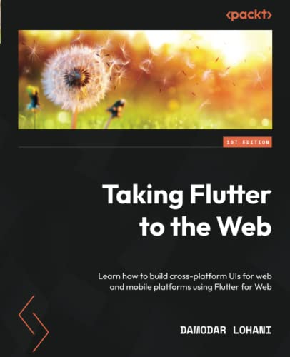

# Namaste, Damodar Here from Nepal! 👋

I'm an author, mentor, trainer, and tech consultant. I'm currently working as a Software Engineer at [Appwrite.io](https://appwrite.io). I'm open for mentoring, training and consultation services.

> 🎉 Exciting News! 🎉
> 
> Level up your Flutter skills in just 30 days with 🚀 [30DaysMasterFlutter](https://appwriters.dev/30days/flutter) 🚀
>
> 👨‍💻 [Join the fun and become a Flutter pro!](https://appwriters.dev/30days/flutter) 💪👩‍💻

## Hey I Just Published a Book

 

## 👷 Check out what I'm currently working on

  - [Master Flutter](https://masterflutter.appwriters.dev)
  - [Appwriters.dev](https://appwriters.dev)
  - [Appwrite](https://github.com/appwrite/appwrite)
  - [Appwrite Auth Kit](https://github.com/lohanidamodar/appwrite_auth_kit)
  - [Clean Nepali Calendar](https://github.com/lohanidamodar/clean_nepali_calendar)
  - [Utopia Dart Framework](https://github.com/utopia-dart)

## Tech Stack
   

## Connect with me:

## 📺 Latest YouTube Videos
<!-- YOUTUBE:START -->
- [Flutter 3.10 - 🌐 Fusion Unleashed: Embedding Flutter Web in a SvelteKit Application](https://www.youtube.com/watch?v=sK-wmZg9LoY)
- [Embark on Your Flutter Adventure:  Master Dart and Flutter in Just 30 Days #30DaysMasterFlutter](https://www.youtube.com/watch?v=OsnAmPDo83Y)
- [Appwrite Cloud Now in Public Beta - Signup and Get Started Today](https://www.youtube.com/watch?v=IGyq57mI1CU)
- [DEVLOG T2S [#3] - Flutter + Appwrite Authentication](https://www.youtube.com/watch?v=YtL4zWQ-I18)
- [DEVLOG T2S [#2] - Building my Side Project with Flutter + Appwrite](https://www.youtube.com/watch?v=uDSYiT5Kxnw)
- [DEVLOG T2S [#1] - Building my Side Project with Flutter + Appwrite](https://www.youtube.com/watch?v=PgH2FDYJ1XI)
- [PopupBits DEVLOG #3 - Rebuilding company website using svelte kit](https://www.youtube.com/watch?v=-O2-mYC6r6E)
- [Popup Bits Devlog #2 - Rebuilding Portfolio Website with Svelte Kit](https://www.youtube.com/watch?v=19_dnSMcKcU)
- [PopupBits Devlog #1 - Rebuilding Portfolio Website with Svelte Kit](https://www.youtube.com/watch?v=cQZr-bjZBXI)
- [How to Contribute to Appwrite](https://www.youtube.com/watch?v=aDYveq0wJFQ)
<!-- YOUTUBE:END -->

## 📕 Latest Blog Posts
<!-- BLOG-POST-LIST:START -->
- [Using the url_launcher Plugin in Flutter - A Comprehensive Guide](https://appwriters.dev/blog/using-the-url-launcher-plugin-in-flutter-a-comprehensive-guide)
- [A Beginner&#39;s Guide to Persisting Data with Shared Preferences in Flutter](https://appwriters.dev/blog/a-beginners-guide-to-persisting-data-with-shared-preferences-in-flutter)
- [A Beginner&#39;s Guide to the HTTP Package in Flutter](https://appwriters.dev/blog/a-beginners-guide-to-the-http-package-in-flutter)
- [Diving Deeper into Asynchronous Programming with Futures in Flutter](https://appwriters.dev/blog/diving-deeper-int-asynchronous-programming-with-futures-in-flutter)
- [Making Friends with Asynchronous Programming and Futures in Flutter](https://appwriters.dev/blog/making-friends-with-asynchronous-programming-and-futures-in-flutter)
- [Flutter Password Less Authentication with Appwrite Magic URL](https://appwriters.dev/blog/flutter-password-less-authentication-with-appwrite-magic-url)
- [Join our #30DaysMasterFlutter Challenge and Learn Flutter &amp; Dart in One Month!](https://dev.to/lohanidamodar/join-our-30daysmasterflutter-challenge-and-master-flutter-dart-in-one-month-16be)
- [The #30DaysMasterFlutter Journey Has Begun! 🚀](https://appwriters.dev/blog/30daysmasterflutter-journey-has-begun)
- [Protect Your Applications from Bad Passwords - Introducing Password History](https://dev.to/appwrite/protect-your-applications-from-bad-passwords-introducing-password-history-19n5)
- [Get Started with Testing in Flutter](https://appwriters.dev/blog/get-started-with-testing-in-flutter)
<!-- BLOG-POST-LIST:END -->

[website]: https://dlohani.com.np
[twitter]: https://twitter.com/lohanidamodar
[youtube]: https://youtube.com/reactbits
[linkedin]: https://linkedin.com/in/lohanidamodar
